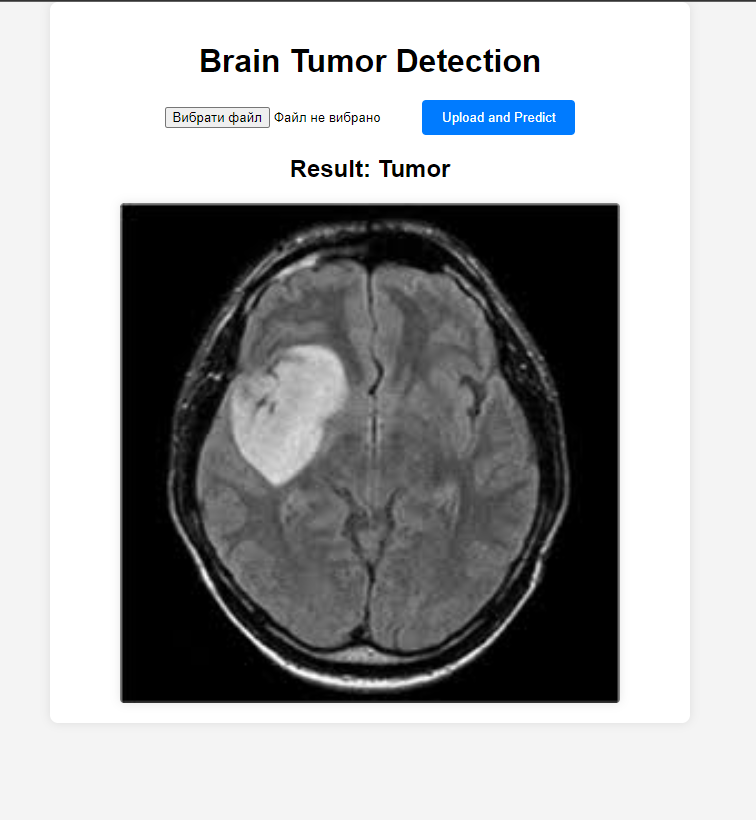

# BrainTumorDetectionbyMRI_CNN_DL
This project focuses on creating a web application for the detection of brain tumors using MRI images. The application utilizes a deep learning model trained on a dataset of MRI scans to make predictions.

<br>

### Kaggle: https://www.kaggle.com/datasets/navoneel/brain-mri-images-for-brain-tumor-detection

<br>

## Getting Started

1. Clone the repository:

    ```bash
    git clone https://github.com/jabka1/BrainTumorDetectionbyMRI_CNN_DL
    cd BrainTumorDetectionbyMRI_CNN_DL
    ```

<br>

## Usage

### 1. Start Flask App
To start the Flask app, open a terminal in the project folder and run:

```bash
cd App
python app.py
```
The Flask app will be accessible at http://localhost:5000.

### 2. Upload MRI Images
Once the web application is running, navigate to http://localhost:5000 in your web browser. You'll see an interface to upload MRI images.

### 3. Select and Upload MRI Image
Click the "Choose File" button to select an MRI image file from your local machine. Once selected, click the "Upload and Predict" button to initiate the prediction process.

### 4. View Prediction Result
After uploading an MRI image and initiating the prediction process, the application will analyze the image using the deep learning model. The prediction result will be displayed on the webpage, indicating whether a tumor is present or not.

<br>

## Demo



<br>

